# AWS Cloud Deployment — Classroom Presence Platform

## Overview

The Classroom Presence Platform is a MERN application (React frontend, Node.js/Express backend, MongoDB Atlas database). This project (Project 1 of my Cloud/DevOps portfolio) covers **manually deploying the application to AWS** — provisioning an EC2 server for the backend, configuring Nginx and PM2, and hosting the React frontend on S3 — without any automation, to build a solid foundation in core AWS infrastructure before introducing containers and CI/CD in later projects.

## Architecture

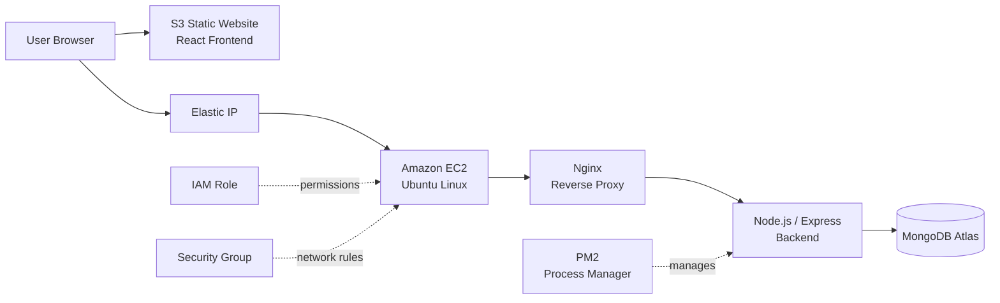

The React frontend is built and served directly from an **S3 static website endpoint**. The Express backend runs on an **EC2 instance**, managed by **PM2** and fronted by **Nginx**, which reverse-proxies incoming HTTP traffic to the Node app. An **Elastic IP** gives the instance a fixed public address, a **Security Group** restricts inbound access, and an **IAM role** attached to EC2 grants the permissions used to sync the frontend build to S3 via the AWS CLI — no access keys stored on the server.

## AWS Services & Technologies

| Technology / Service | Purpose |
|---|---|
| Amazon EC2 | Hosts the Node.js/Express backend on a t3.micro Ubuntu instance |
| Ubuntu Linux | Server OS (24.04.4 LTS) for the backend instance |
| SSH | Secure remote access to the EC2 instance for setup and deployment |
| Security Groups | Firewall rules restricting SSH to a known IP and allowing HTTP |
| Elastic IP | Static public IP so the backend address doesn't change on reboot |
| Nginx | Reverse proxy routing incoming HTTP requests to the Node app |
| PM2 | Keeps the backend process alive, auto-restarts it, and starts it on boot |
| Amazon S3 | Hosts the built React frontend as a static website |
| AWS IAM (Role) | Attached to EC2 so the CLI can access S3 without hardcoded credentials |
| AWS CLI | Used on the EC2 instance to verify identity and sync the frontend build to S3 |
| MongoDB Atlas | Managed cloud database for the backend |

## Implementation

### 1. EC2 & Security Configuration
Launched a t3.micro Ubuntu 24.04 instance in a default VPC with auto-assigned public IP. A new security group was created allowing **SSH from my IP only** and **HTTP from the internet**; HTTPS was left disabled at this stage. Connected to the instance over SSH using a dedicated key pair.

### 2. Backend Deployment
Cloned the project onto the instance and ran the Express server with `npm start` from the `backend` directory. The server connected successfully to **MongoDB Atlas** and started listening on port 5000.

### 3. Nginx & PM2
**Nginx** was configured as a reverse proxy — enabling a `sites-available` config, disabling the default site, validating with `nginx -t`, and reloading the service — so the backend is reachable over standard HTTP instead of exposing port 5000 directly. **PM2** manages the Node process itself: it was registered as a systemd service (`pm2 startup` + `pm2 save`) so the backend restarts automatically on crash or reboot. `pm2 status` confirms the process running online. A browser check of `/api/health` through Nginx returned a successful JSON response, confirming the reverse proxy and backend were both working end-to-end.

### 4. S3 Frontend Deployment
Created an S3 bucket and enabled **static website hosting**, generating a public website endpoint. Since static hosting requires public reads, **Block Public Access** was turned off for the bucket and a bucket policy was attached granting `s3:GetObject` on the bucket's contents. The React app's production build was synced up to the bucket using the AWS CLI.

### 5. IAM & S3 Access
An IAM role (**ClassroomPresenceEC2S3Role**) was created and attached to the EC2 instance so the server could interact with S3 without storing access keys locally. On the instance, the AWS CLI was installed and `aws sts get-caller-identity` was used to confirm the role's credentials were active (it failed with a "NoCredentials" error before the role was attached, and succeeded afterward). `aws s3 ls` confirmed bucket visibility, and `aws s3 sync build/ s3://<bucket>/` uploaded the full production build — HTML, JS/CSS bundles, and static model assets — directly from the EC2 instance to S3.

## Security Considerations

- **Security Group**: SSH access limited to a specific IP; HTTP open to the internet for the application; HTTPS not enabled in this project.
- **IAM Role over static keys**: The EC2 instance uses an attached IAM role for S3 access instead of long-lived access keys.
- **S3 bucket policy**: Public access is scoped narrowly to `s3:GetObject` on the bucket's contents — required for static website hosting, not a blanket public-access grant.

This setup demonstrates working AWS access controls for a learning project; it has not been hardened for production use.

## Verification

| Verification | Result |
|---|---|
| Backend `/api/health` endpoint | Successful — returned `{"status":"ok", ...}` |
| MongoDB Atlas connection | Successful — confirmed in server startup logs |
| Nginx reverse proxy | Active and routing traffic to the backend |
| PM2 process | Running, online, and set to restart on boot |
| IAM role / CLI identity | Verified via `aws sts get-caller-identity` |
| S3 frontend deployment | Successful — build synced via `aws s3 sync` |
| Final website | Successfully accessible via the S3 static website endpoint |

## Screenshots

### EC2 & Infrastructure
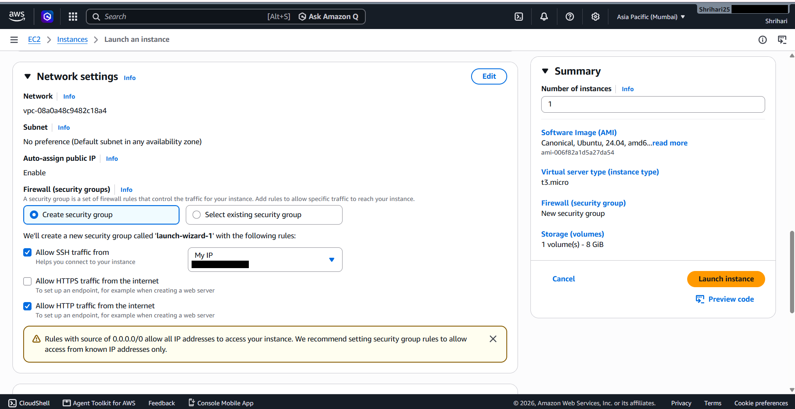
*Launching the t3.micro Ubuntu instance with a new security group (SSH + HTTP).*

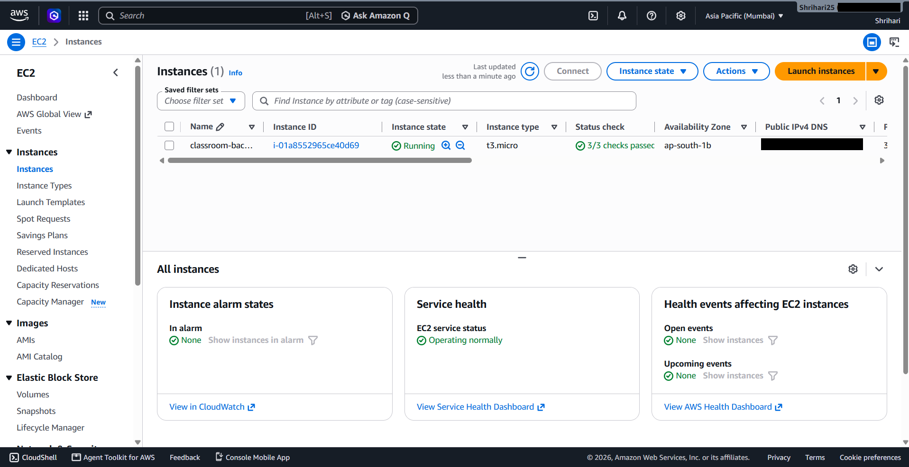
*Instance running with 3/3 status checks passed.*

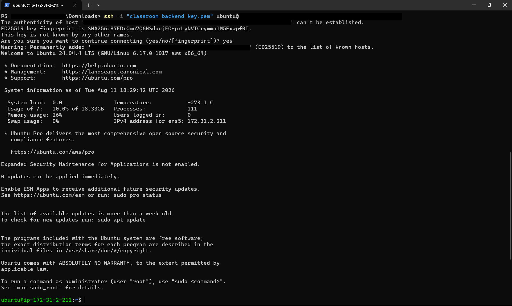
*Connecting to the instance over SSH; confirms Ubuntu 24.04.4 LTS.*

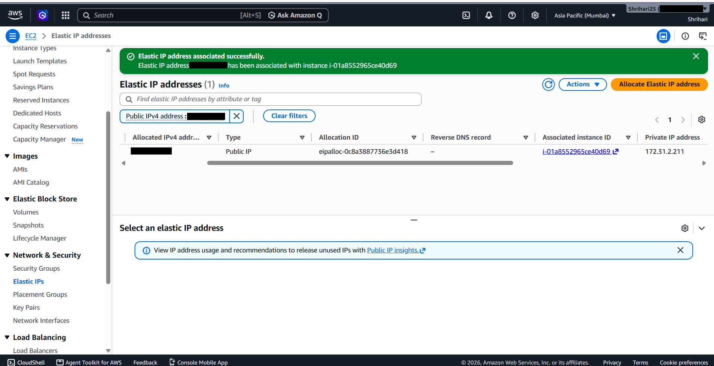
*Elastic IP successfully allocated and associated with the instance.*

### Backend & Server Configuration
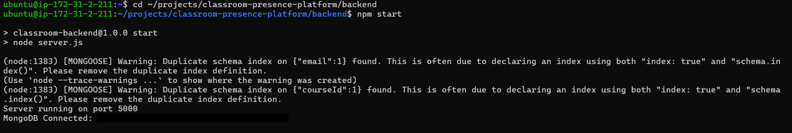
*Starting the Express server; MongoDB Atlas connects and the server listens on port 5000.*

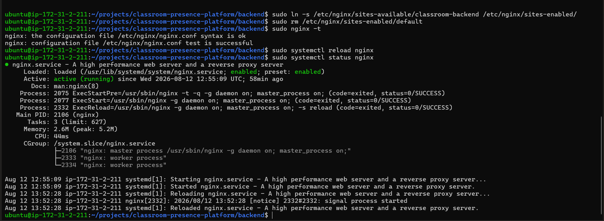
*Enabling the Nginx site config, validating syntax, and confirming the service is active.*

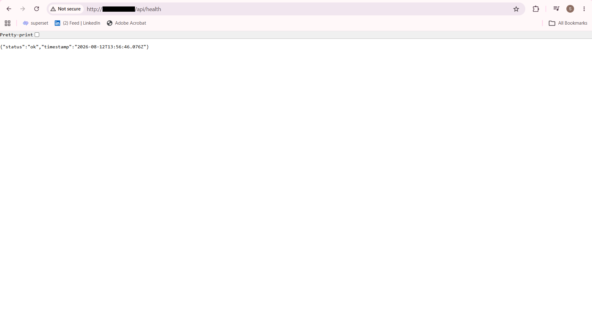
*Backend `/api/health` endpoint responding successfully through Nginx.*

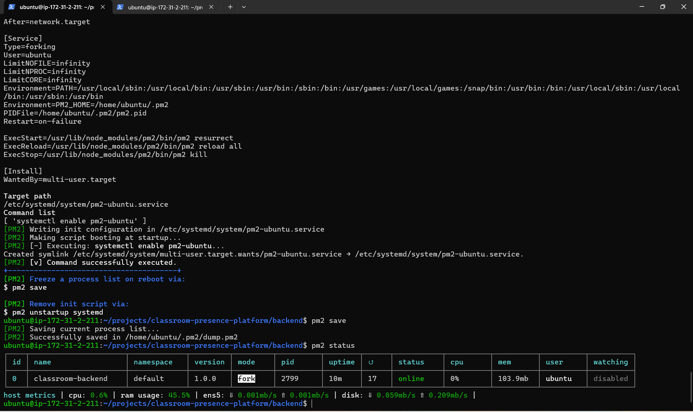
*PM2 managing the backend process as a systemd service, shown online via `pm2 status`.*

### S3 Deployment
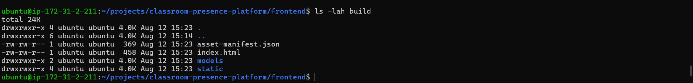
*React production build ready for deployment.*

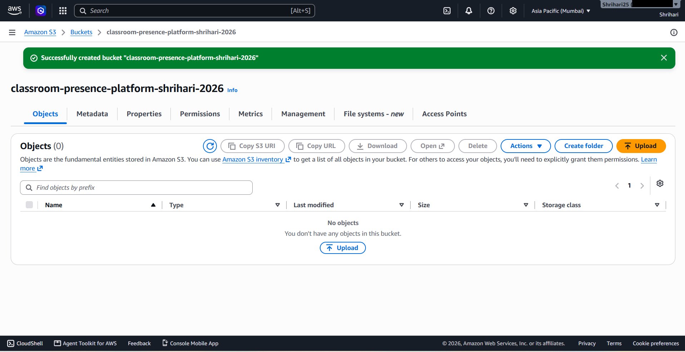
*S3 bucket created to host the frontend.*

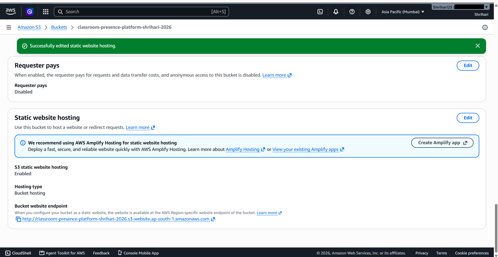
*Static website hosting enabled with a public bucket endpoint.*

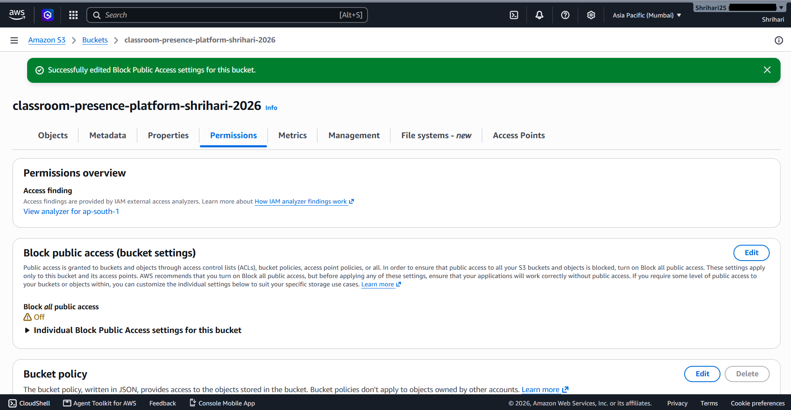
*Block Public Access disabled to allow the static site to be reachable.*

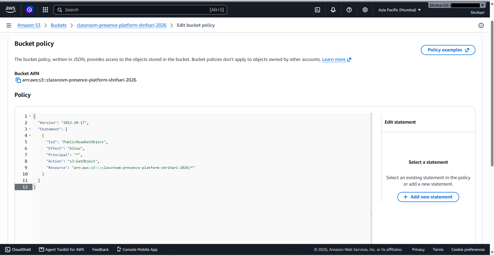
*Bucket policy scoping public access to `s3:GetObject` only.*

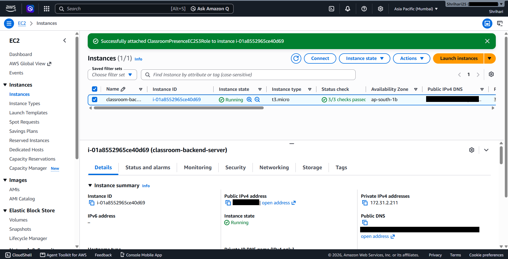
*IAM role attached to the EC2 instance for S3 access.*

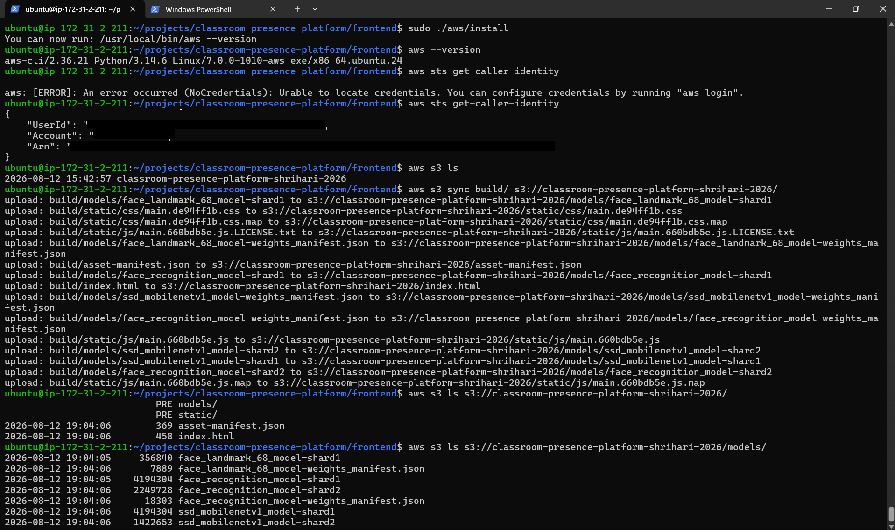
*Verifying IAM role credentials and syncing the build to S3 via the AWS CLI.*

### Final Application
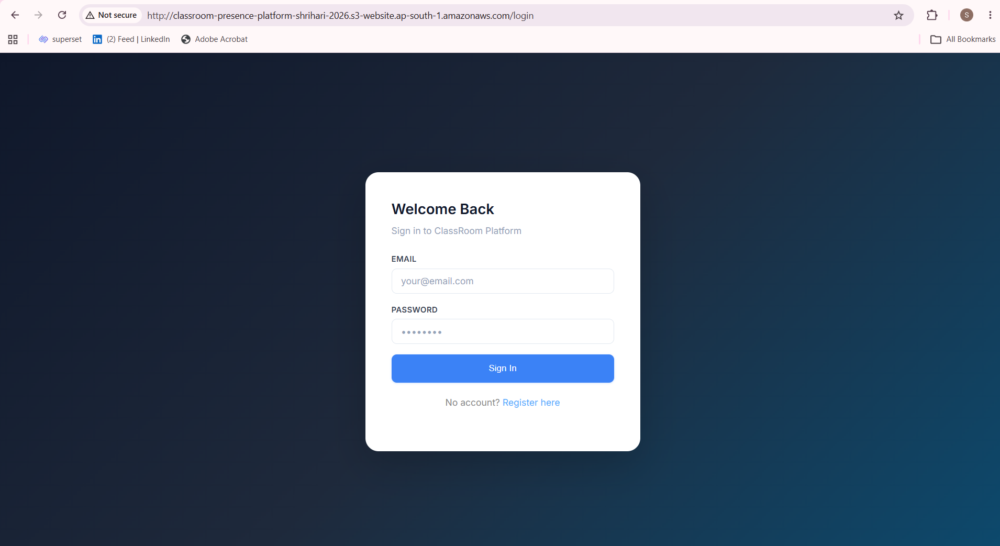
*Frontend live and accessible via the S3 static website endpoint.*

## Key Learnings

- Provisioning and securing an EC2 instance, including Security Group rules for SSH/HTTP access
- Linux server administration on Ubuntu — navigating, running services, checking logs
- Configuring Nginx as a reverse proxy for a Node.js backend
- Using PM2 for process management and boot-time persistence via systemd
- Hosting a static frontend on S3, including bucket policies and public-access configuration
- Using IAM roles for secure, key-free service-to-service access
- Verifying deployments end-to-end using the AWS CLI and browser-based checks

## Future Improvements

The following were **not** implemented in this project but are addressed in later stages of this portfolio:
- Containerization with Docker
- CI/CD automation for deployments
- Monitoring and logging (e.g., CloudWatch)
- HTTPS/SSL and a custom domain
