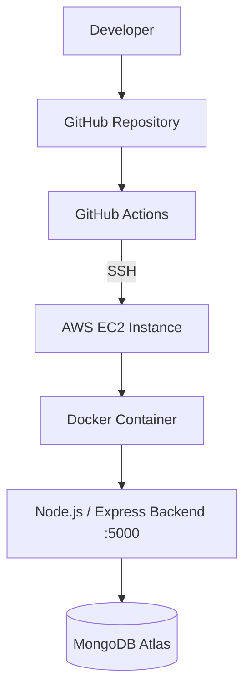
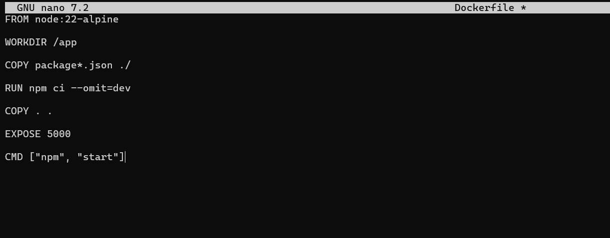
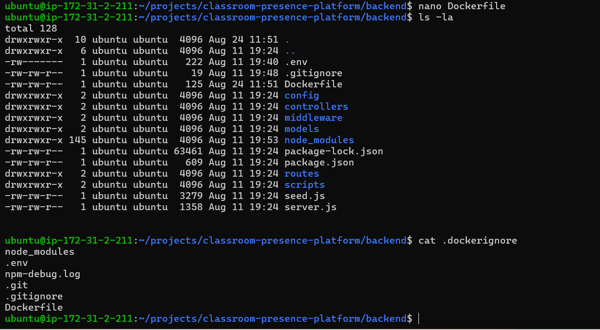
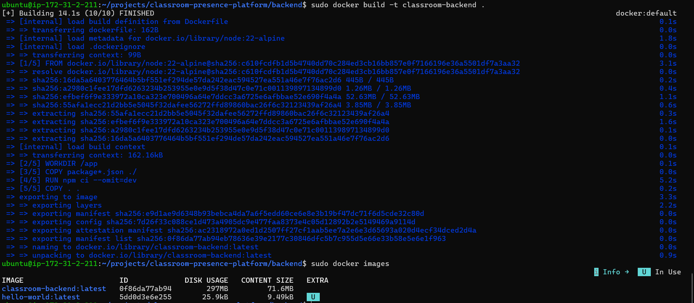
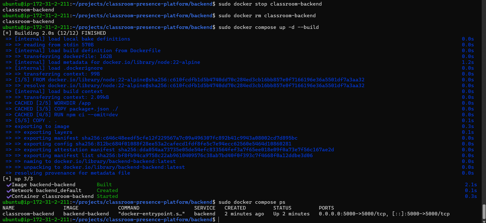
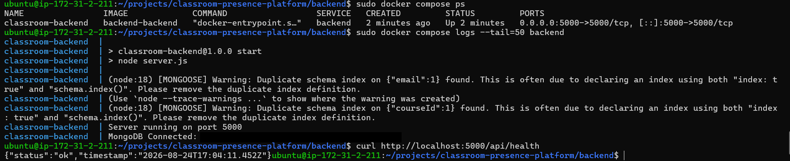
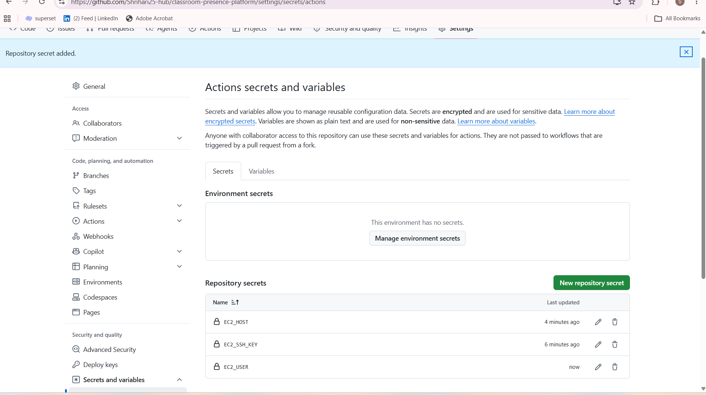
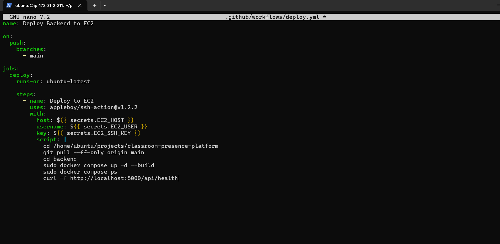
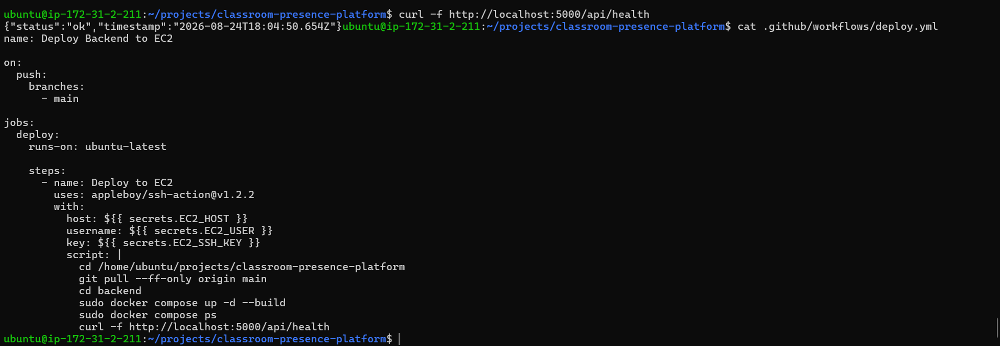
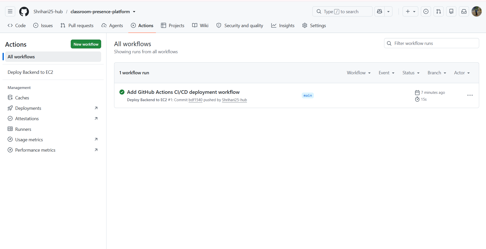

# Classroom Presence Platform — Docker + CI/CD
 
## Overview
 
This project takes the Classroom Presence Platform backend (originally deployed manually in [Project 1](#related-projects)) and containerizes it with **Docker**, then automates its deployment with **GitHub Actions**. Instead of managing the Node.js process by hand on the EC2 instance, the backend now runs inside a Docker container defined by Docker Compose, and every push to `main` triggers an automated SSH-based deployment that pulls the latest code, rebuilds the Docker container, and verifies the backend.
 
The goal was to move from a manually-run backend to a repeatable, containerized deployment process — a practical first step into DevOps automation before introducing monitoring in Project 3.
 
## Architecture
 

 
Pushing to `main` triggers a **GitHub Actions** workflow that connects to the **EC2 instance** over **SSH**, pulls the latest code, and rebuilds the backend using **Docker Compose**. The resulting **Docker container** runs the **Node.js/Express** backend on port 5000, which connects out to **MongoDB Atlas**. The EC2 instance itself is the same one provisioned in Project 1 — this project changes how the backend runs on it, not the underlying infrastructure.
 
## Technologies & Services
 
| Technology / Service | Purpose |
|---|---|
| Docker | Packages the backend into a container with a consistent runtime |
| Docker Compose | Builds and runs the backend container, handles port mapping |
| GitHub Actions | Automates build and deployment on every push to `main` |
| Git / GitHub | Version control for application code and workflow |
| SSH (`appleboy/ssh-action`) | Executes deployment commands on EC2 from the CI/CD pipeline |
| AWS EC2 | Hosts the Dockerized backend (same instance used in Project 1) |
| Node.js / Express | Backend application framework |
| MongoDB Atlas | Managed database the backend connects to at runtime |
 
## Implementation
 
### Dockerization
 
Docker CE, the Docker CLI, containerd, Buildx, and the Compose plugin were installed on the existing Ubuntu EC2 instance, and the installation was verified with `docker run hello-world`.
 
A `Dockerfile` was added to the backend, based on `node:22-alpine`: it sets the working directory, installs production dependencies with `npm ci --omit=dev`, copies in the source, exposes port 5000, and starts the app with `npm start`. A `.dockerignore` file excludes `node_modules`, `.env`, `.git`, and other files that don't belong in the image.
 
The image was built and tagged `classroom-backend:latest`, then a `compose.yaml` file was added to run the backend as a service, mapping host port 5000 to container port 5000. `docker compose up -d --build` builds and starts the container, and `docker compose ps` confirms it's up with the expected port mapping. Container logs were checked to confirm the backend connects to MongoDB Atlas and starts listening on port 5000, followed by a `curl` check against `/api/health`.
 
The backend had previously been running under **PM2**. During the switch to Docker, both attempted to use port 5000, causing a port conflict. The PM2 process was stopped so the Docker container could take over the port.
 
### CI/CD Pipeline
 
A GitHub Actions workflow at `.github/workflows/deploy.yml` automates deployment. It triggers on pushes to `main`, runs on `ubuntu-latest`, and uses `appleboy/ssh-action@v1.2.2` to SSH into the EC2 instance. Once connected, it:
 
1. Navigates to the project directory and runs `git pull --ff-only origin main`
2. Moves into the backend directory and runs `sudo docker compose up -d --build`
3. Verifies the container with `sudo docker compose ps`
4. Confirms the backend is healthy with `curl -f http://localhost:5000/api/health`
The first workflow run failed with an SSH port 22 timeout — the runner couldn't reach the EC2 instance. After correcting the SSH/security group configuration, the workflow connected successfully and completed the deployment end to end.
 
### Deployment Authentication
 
A dedicated ED25519 SSH key pair was generated specifically for GitHub Actions, separate from any personal SSH keys. The public key was added to the EC2 `ubuntu` user's `~/.ssh/authorized_keys`, and the private key, EC2 host, and username were stored as GitHub Actions repository secrets, rather than being hardcoded in the workflow.
 
## Security Considerations
 
- Deployment credentials are stored as **GitHub Actions repository secrets**, not in the workflow file or source code.
- A **dedicated SSH key** is used only for CI/CD deployment, kept separate from personal access keys.
- The private key and other sensitive values are never committed to the repository.
- `.env` and other local configuration are excluded from both Git (`.gitignore`) and the Docker build context (`.dockerignore`).
- SSH access to EC2 is controlled through its security group configuration.
## Verification
 
| Check | Result |
|---|---|
| Docker installation | Verified with `docker run hello-world` |
| Image build | `classroom-backend:latest` built successfully |
| Container status | `docker compose ps` — container up, `5000:5000` mapped |
| Container logs | Confirm MongoDB Atlas connection and server startup on port 5000 |
| Health endpoint | `curl -f http://localhost:5000/api/health` |
| GitHub Actions deployment | Workflow completed successfully after fixing the SSH timeout |
 
```bash
curl -f http://localhost:5000/api/health
```
 
```json
{
  "status": "ok"
}
```
 
## Screenshots
 
### Containerizing the Backend
 
**01. Backend Dockerfile**

Node.js 22 (alpine) base image, dependency install, port 5000 exposed, and `npm start` as the container command.
 
**02. Backend structure & .dockerignore**

Backend directory layout alongside the `.dockerignore` file excluding `node_modules`, `.env`, and other files from the image.
 
**03. Docker image build**

Building the `classroom-backend` image; `docker images` lists it alongside `hello-world`, used earlier to verify the Docker installation.
 
**04. Docker Compose up**

Starting the backend with Docker Compose using `docker compose up -d --build`, followed by verification with docker compose ps.
 
**05. Logs and health check**

Container logs confirming the MongoDB connection and the server listening on port 5000, followed by a successful `/api/health` check.
 
### CI/CD Pipeline
 
**06. GitHub Actions secrets**

`EC2_HOST`, `EC2_USER`, and `EC2_SSH_KEY` stored as repository secrets rather than in the workflow file.
 
**07. CI/CD workflow file**

`.github/workflows/deploy.yml` — triggers on push to `main` and uses `appleboy/ssh-action` to deploy over SSH.
 
**08. Workflow verified on EC2**

Verifying the backend health check and deployed GitHub Actions workflow directly on the EC2 instance.
 
**09. Successful GitHub Actions run**

The Deploy Backend to EC2 workflow completing successfully after the SSH connectivity issue was resolved.
 
## Key Learnings
 
- Containerizing an existing Node.js/Express backend with a purpose-built Dockerfile, rather than building an app from scratch for Docker.
- Managing the container lifecycle with Docker Compose — building, running, inspecting status, and reading logs.
- Diagnosing and resolving a port conflict between a PM2-managed process and a Docker container competing for the same port.
- Writing a GitHub Actions workflow that authenticates over SSH and runs real deployment commands on a remote server.
- Troubleshooting an SSH port 22 timeout in GitHub Actions and tracing it to the EC2 network/security-group configuration.
- Verifying a deployment through container status and an HTTP health endpoint instead of manually logging in to check.
## Future Improvements
 
The following are potential next steps, not yet implemented:
 
- Automated tests in the CI pipeline before deployment
- Docker `HEALTHCHECK` for container-level health monitoring
- Pushing built images to a registry instead of building directly on the EC2 instance
- A rollback strategy for failed deployments
- Improved secret and configuration management
- Deployment notifications (e.g., Slack or email on success/failure)
## Related Projects
 
**[Project 1 — AWS Deployment](https://github.com/Shrihari25-hub/classroom-presence-cloud-deployment/tree/main/project-1-aws-deployment)**
The original manual AWS deployment of the Classroom Presence Platform (EC2, Nginx, PM2, S3).
 
