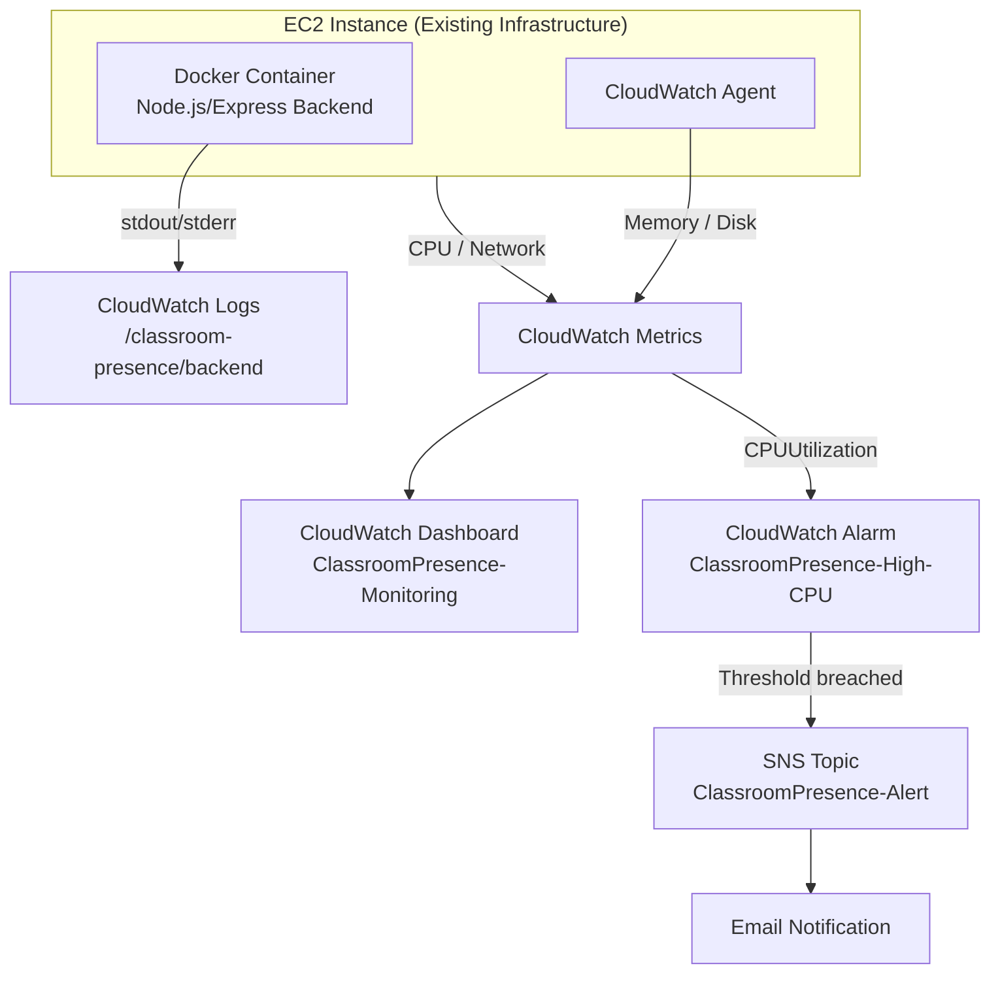
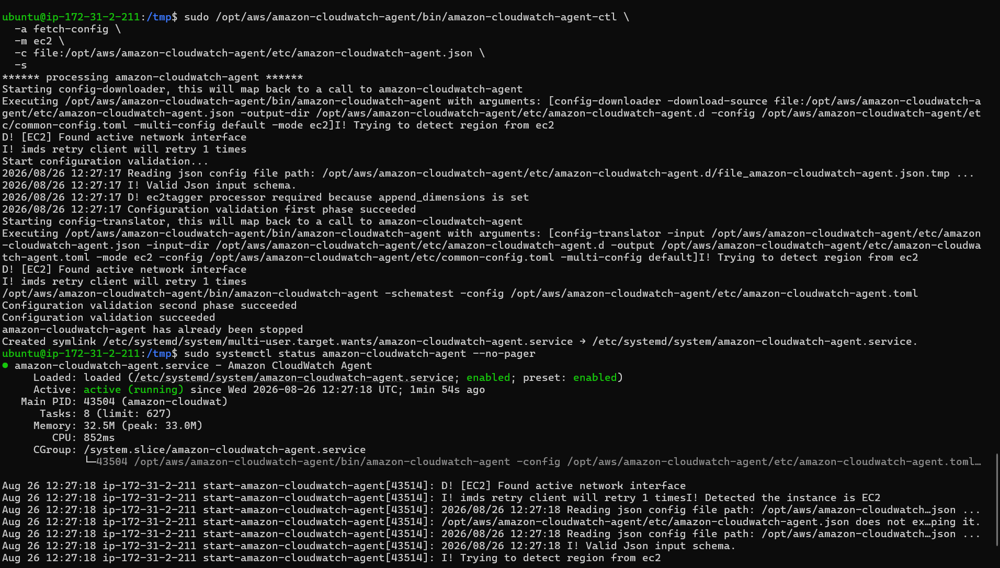
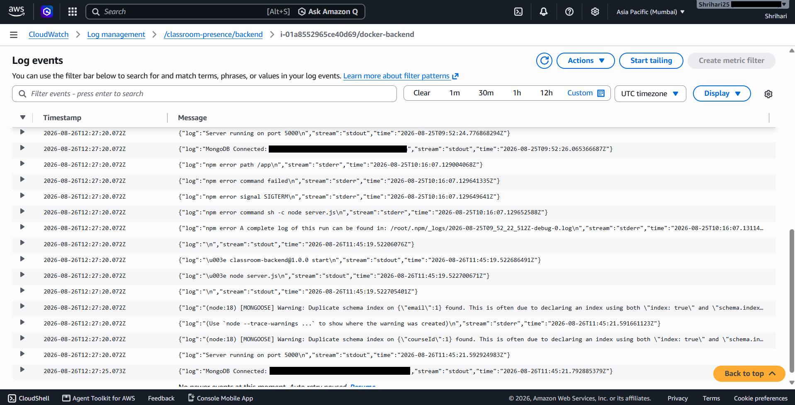
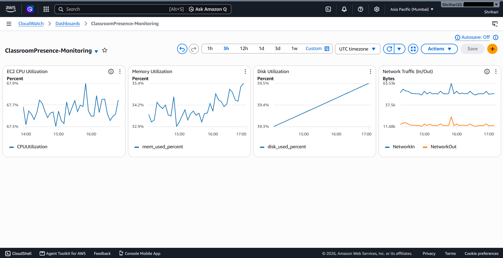
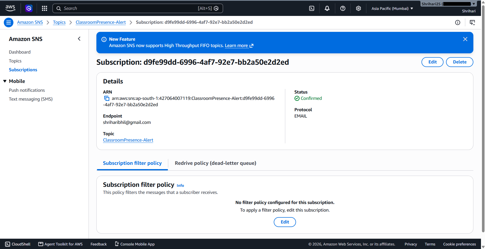
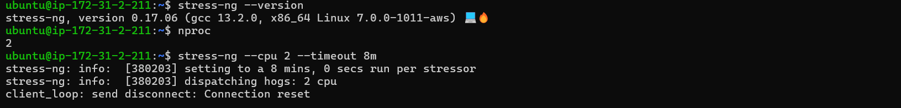
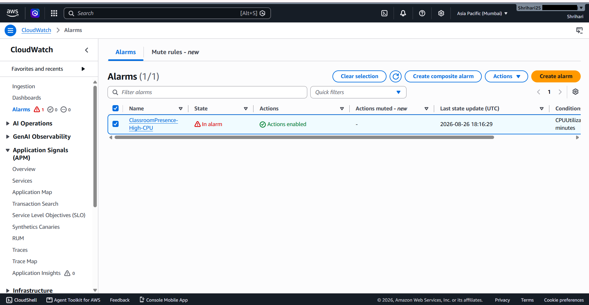
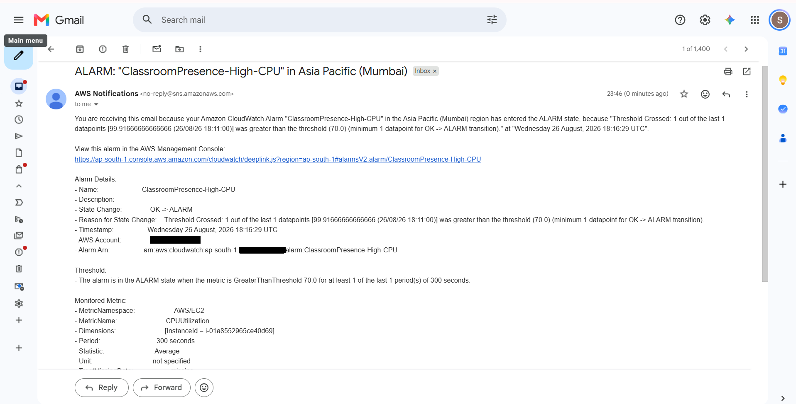

# Classroom Presence Platform — AWS Monitoring & Logging

## Overview

This project adds monitoring, centralized application logging, dashboards, and alerting to the Dockerized backend deployed in [Project 2](#related-projects). it builds observability on top of the existing EC2/Docker infrastructure using **Amazon CloudWatch** and **Amazon SNS**.

The goal was to monitor the existing backend, centralize its logs, and set up alerts for high CPU usage using CloudWatch and SNS. The setup included the CloudWatch Agent for host-level metrics, CloudWatch Logs for Docker backend logs, a monitoring dashboard, and a CPU alarm connected to an SNS email notification. The alert was also tested under load to verify that the monitoring and notification flow worked as expected.

## Architecture



CloudWatch sits alongside the application rather than in its request path. It collects infrastructure metrics and application logs from the existing EC2/Docker setup, while the application itself continues to run as it did in Project 2.

## Technologies & AWS Services

| Technology / Service | Purpose |
|---|---|
| Amazon CloudWatch Agent | Collects host-level metrics not available by default (memory, disk) |
| Amazon CloudWatch Metrics | Stores and graphs CPU, memory, disk, and network metrics |
| Amazon CloudWatch Logs | Centralizes Docker container stdout/stderr from the backend |
| Amazon CloudWatch Dashboards | Single view combining infrastructure metrics |
| Amazon CloudWatch Alarms | Evaluates CPU utilization and triggers on threshold breach |
| Amazon SNS | Delivers email notifications when the alarm fires |
| stress-ng | Generates controlled CPU load to test the alarm end to end |
| AWS EC2 (Ubuntu) | Same instance from Project 1, now also running the CloudWatch Agent |

## Monitoring & Logging Implementation

### CloudWatch Agent

The Amazon CloudWatch Agent was installed on the existing Ubuntu EC2 instance and configured to report host-level metrics that aren't part of the default EC2 metric set:

```bash
sudo /opt/aws/amazon-cloudwatch-agent/bin/amazon-cloudwatch-agent-ctl \
  -a fetch-config -m ec2 \
  -c file:/opt/aws/amazon-cloudwatch-agent/etc/amazon-cloudwatch-agent.json -s
```

Configuration validation passed on both phases, and `systemctl status amazon-cloudwatch-agent` confirmed the service was `active (running)`.

### Infrastructure Metrics

| Metric | Source | Notes |
|---|---|---|
| CPU utilization | Standard EC2 (`CPUUtilization`) | Namespace `AWS/EC2` |
| Network In / Out | Standard EC2 (`NetworkIn` / `NetworkOut`) | Namespace `AWS/EC2` |
| Memory utilization | CloudWatch Agent (`mem_used_percent`) | Not available as a default EC2 metric |
| Disk utilization | CloudWatch Agent (`disk_used_percent`) | Not available as a default EC2 metric |

### Centralized Application Logs

Docker container logs from the backend (stdout/stderr, server startup, MongoDB connection status) are centralized in CloudWatch Logs under the log group:

```
/classroom-presence/backend
```

This replaces manually SSH-ing into the instance and running `docker compose logs` to check what the backend is doing — log events are now searchable and centralized in the console.

### CloudWatch Dashboard

A dashboard named `ClassroomPresence-Monitoring` brings CPU, memory, disk, and network into one view instead of checking each metric separately:

| Widget | Metric |
|---|---|
| EC2 CPU Utilization | `CPUUtilization` |
| Memory Utilization | `mem_used_percent` |
| Disk Utilization | `disk_used_percent` |
| Network Traffic (In/Out) | `NetworkIn` / `NetworkOut` |

### CPU Alarm

| Setting | Value |
|---|---|
| Name | `ClassroomPresence-High-CPU` |
| Namespace | `AWS/EC2` |
| Metric | `CPUUtilization` |
| Statistic | Average |
| Period | 5 minutes |
| Threshold | > 70% |
| Evaluation | 1 datapoint within 5 minutes |
| Action | Notify `ClassroomPresence-Alert` (SNS) |

### SNS Notifications

An SNS Standard topic, `ClassroomPresence-Alert`, was created with an email subscription. The subscription was confirmed via the verification link before the alarm was linked to it.

## Alert Testing / Verification

The alerting path was tested with real load rather than left as an unverified configuration. The EC2 instance has 2 vCPUs, confirmed with `nproc`, and load was generated with:

```bash
stress-ng --cpu 2 --timeout 8m
```

This pushed `CPUUtilization` above the 70% threshold, and the alarm transitioned `OK → ALARM`. An email from `AWS Notifications <no-reply@sns.amazonaws.com>` arrived confirming the state change, including the alarm reason, threshold, and monitored metric. Once the load test ended, the alarm returned to `OK`.

| Step | Result |
|---|---|
| CloudWatch Agent installed and running | Verified via `systemctl status` |
| Container logs reaching CloudWatch Logs | Confirmed in `/classroom-presence/backend` |
| Dashboard showing CPU, memory, disk, network | `Dashboard populated with collected EC2 and Agent metrics |
| SNS email subscription | Confirmed |
| Controlled CPU load generated | `stress-ng --cpu 2 --timeout 8m` on a 2-vCPU instance |
| Alarm state transition | `OK → ALARM` |
| SNS email notification received | Confirmed, alarm details matched the console |
| Alarm returned to OK | Confirmed after load test ended |

## Screenshots

**01. CloudWatch Agent configured and running**

Agent configuration validated successfully and `amazon-cloudwatch-agent.service` reporting `active (running)`.

**02. Centralized application logs**

Docker backend log events (server startup, MongoDB connection, npm output) flowing into the `/classroom-presence/backend` log group.

**03. CloudWatch monitoring dashboard**

`ClassroomPresence-Monitoring` dashboard with live CPU, memory, disk, and network widgets.

**04. SNS email subscription confirmed**

Email subscription on the `ClassroomPresence-Alert` topic in `Confirmed` status, required before the alarm can notify it.

**05. Controlled CPU load test**

`stress-ng --cpu 2 --timeout 8m` run against the 2-vCPU instance to deliberately push CPU utilization past the alarm threshold.

**06. CloudWatch alarm triggered**

`ClassroomPresence-High-CPU` showing `In alarm`, confirming the threshold breach was detected.

**07. SNS email notification received**

Actual AWS notification email showing the `OK → ALARM` transition, the breaching datapoint, and the monitored metric — closing the loop from load test to human notification.

## Security Considerations

- No credentials, access keys, or `.env` values are used or exposed anywhere in this monitoring setup.
- AWS account IDs are redacted in the public screenshots. No credentials, access keys, private keys, passwords, tokens, or .env values are exposed, since they       identify the account/owner rather than being required to demonstrate the implementation.
- AWS account identifiers were redacted from the public screenshots; resource identifiers shown for context are not credentials.
- The CloudWatch Agent and SNS topic don't introduce any new inbound access to the EC2 instance; they only read local metrics/logs and send outbound notifications.

## Key Learnings

- Installing and validating the CloudWatch Agent, and understanding why memory and disk metrics need it while CPU and network don't.
- Centralizing the Docker backend logs in CloudWatch Logs group instead of relying on SSH + `docker compose logs`.
- Building a CloudWatch dashboard that combines standard EC2 metrics with CloudWatch Agent-collected memory and disk metrics.
- Configuring a CloudWatch alarm using a defined threshold, statistic, period, and evaluation window.
- Wiring an alarm to an SNS topic and confirming the email subscription — Configuring an SNS email subscription and confirming it before using it as the alarm       notification target.
- Actually generating CPU load with `stress-ng` to verify the alarm fires and resolves correctly, instead of trusting the configuration alone.

## Future Improvements

The following are potential next steps, not yet implemented:

- Application-level metrics (request latency, error rates) beyond host-level CPU/memory/disk
- More granular alarms (e.g., memory or disk thresholds, sustained-load evaluation windows)
- Log retention policies to manage CloudWatch Logs storage over time
- Automated incident response (e.g., Lambda-triggered remediation on alarm)
- Infrastructure as Code (Terraform/CloudFormation) for the monitoring resources themselves
- Additional notification channels (e.g., Slack) alongside email
- A more comprehensive dashboard covering application-level health, not just infrastructure

## Related Projects

**[Project 1 — AWS Deployment](https://github.com/Shrihari25-hub/classroom-presence-cloud-deployment/tree/main/project-1-aws-deployment)**
The original manual AWS deployment of the Classroom Presence Platform (EC2, Nginx, PM2, S3).

**[Project 2 — Docker + CI/CD](https://github.com/Shrihari25-hub/classroom-presence-cloud-deployment/tree/main/project-2-docker-cicd)**
Containerized the backend with Docker and automated deployment with GitHub Actions.
